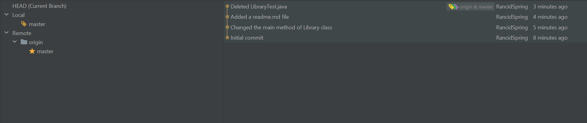

## Overview
This is the first test project for COMP3111 course at HKUST. 

**Please note** that I used Intellij IDEA during this lab. That's why there can be some structural differences between the version generated by Eclipse and this one.
I worked in IDEA for a long time now and got really used to it.

## Assignments
### First step
- Name: **Lev Kisselyov**
- Student ID: 20939312

